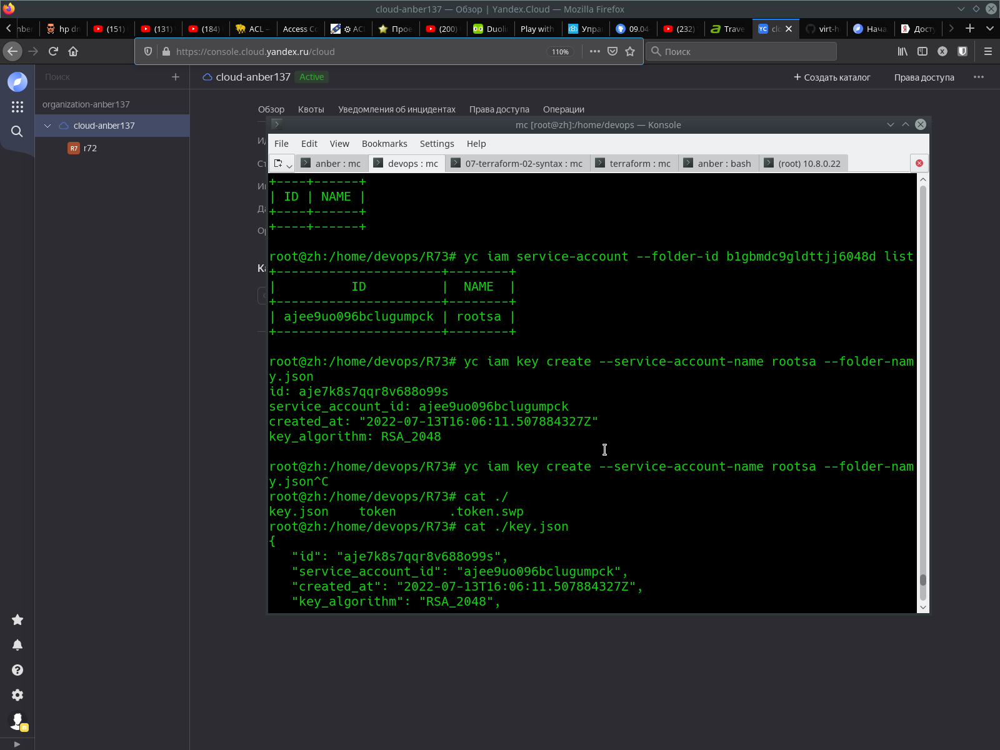

# Домашнее задание к занятию "7.2. Облачные провайдеры и синтаксис `Terraform`."

## Задача 1 (Вариант с `Yandex.Cloud`). Регистрация в ЯО и знакомство с основами (необязательно, но крайне желательно).

Решение:



## Задача 2. Создание aws `ec2` или `yandex_compute_instance` через терраформ.

Решение:

Результат команды `terraform plan`:


```
root@debian:/home/R72# terraform plan                                                                                                                        
                                                                                                                                                             
Terraform used the selected providers to generate the following execution plan. Resource actions are indicated with the following symbols:                   
  + create                                                                                                                                                   
                                                                                                                                                             
Terraform will perform the following actions:                                                                                                                
                                                                                                                                                             
  # yandex_compute_instance.vm will be created                                                                                                               
  + resource "yandex_compute_instance" "vm" {                                                                                                                
      + created_at                = (known after apply)                                                                                                      
      + folder_id                 = (known after apply)
      + fqdn                      = (known after apply)
      + hostname                  = (known after apply)
      + id                        = (known after apply)
      + name                      = "node01"
      + network_acceleration_type = "standard"
      + platform_id               = "standard-v1"
      + service_account_id        = (known after apply)
      + status                    = (known after apply)
      + zone                      = (known after apply)

      + boot_disk {
          + auto_delete = true
          + device_name = (known after apply)
          + disk_id     = (known after apply)
          + mode        = (known after apply)

          + initialize_params {
              + block_size  = (known after apply)
              + description = (known after apply)
              + image_id    = "fd8qs44945ddtla09hnr"
              + name        = (known after apply)
              + size        = 10
              + snapshot_id = (known after apply)
              + type        = "network-hdd"
            }
        }

      + network_interface {
          + index              = (known after apply)
          + ip_address         = (known after apply)
          + ipv4               = true
          + ipv6               = false
          + ipv6_address       = (known after apply)
          + mac_address        = (known after apply)
          + nat                = true
          + nat_ip_address     = (known after apply)
          + nat_ip_version     = (known after apply)
          + security_group_ids = (known after apply)
          + subnet_id          = (known after apply)
        }

      + placement_policy {
          + host_affinity_rules = (known after apply)
          + placement_group_id  = (known after apply)
        }

      + resources {
          + core_fraction = 100
          + cores         = 1
          + memory        = 1
        }

      + scheduling_policy {
          + preemptible = (known after apply)
        }
    }

  # yandex_vpc_network.net will be created
  + resource "yandex_vpc_network" "net" {
      + created_at                = (known after apply)
      + default_security_group_id = (known after apply)
      + folder_id                 = (known after apply)
      + id                        = (known after apply)
      + labels                    = (known after apply)
      + name                      = "net"
      + subnet_ids                = (known after apply)
    }

  # yandex_vpc_subnet.subnet will be created
  + resource "yandex_vpc_subnet" "subnet" {
      + created_at     = (known after apply)
      + folder_id      = (known after apply)
      + id             = (known after apply)
      + labels         = (known after apply)
      + name           = "subnet"
      + network_id     = (known after apply)
      + v4_cidr_blocks = [
          + "192.168.1.0/24",
        ]
      + v6_cidr_blocks = (known after apply)
      + zone           = "ru-central1-a"
    }

Plan: 3 to add, 0 to change, 0 to destroy.

────────────────────────────────────────────────────────────────────────────────────────────────────────────────────────────────────────────────────────────

Note: You didn't use the -out option to save this plan, so Terraform can't guarantee to take exactly these actions if you run "terraform apply" now.
root@debian:/home/R72# 

```

## 1. Ответ на вопрос: при помощи какого инструмента (из разобранных на прошлом занятии) можно создать свой образ ami?

### Ответ: `Packer` (ответ точно был во второй лекции к данному занятию)

## 2. Ссылку на репозиторий с исходной конфигурацией терраформа

### [Ответ](https://github.com/anber137/bash_1/tree/main/R72) 


