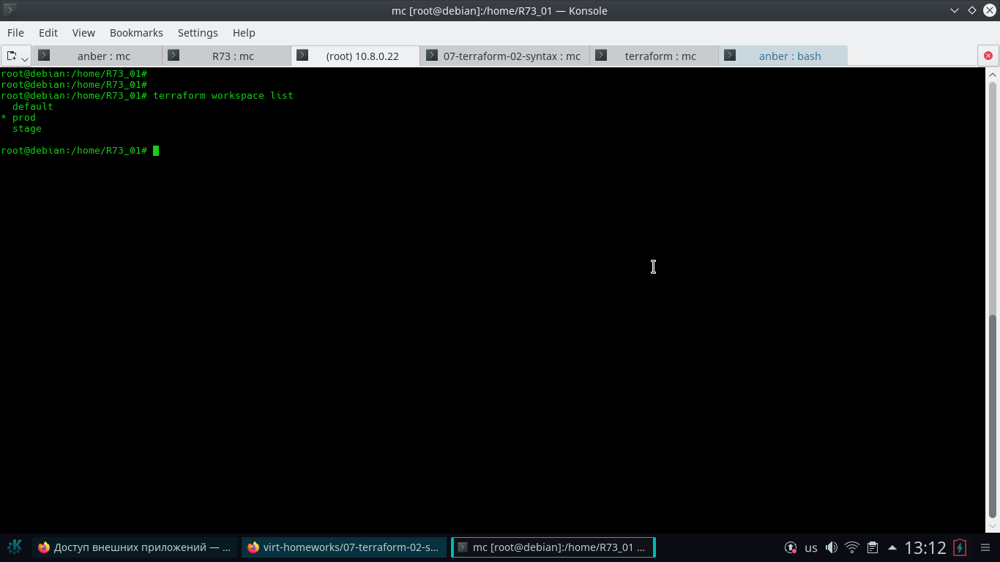

# Домашнее задание к занятию "7.3. Основы и принцип работы Терраформ"

## [Ответ 1-7](https://github.com/anber137/bash_1/tree/main/R73)

## Вывод команды terraform workspace list

## Вывод команды terraform plan для воркспейса prod:

Возникли некоторые сложности с подключением к `aws`
