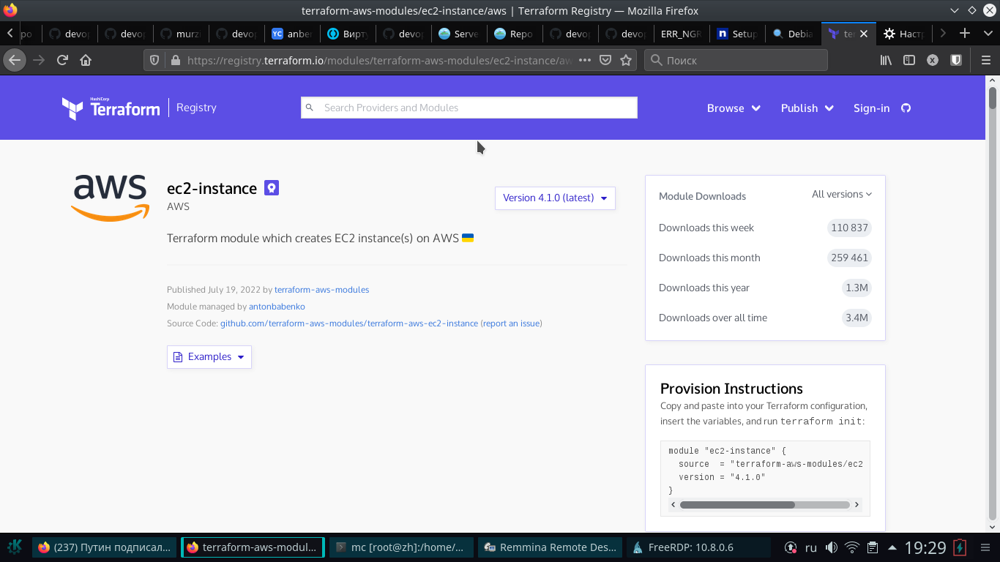
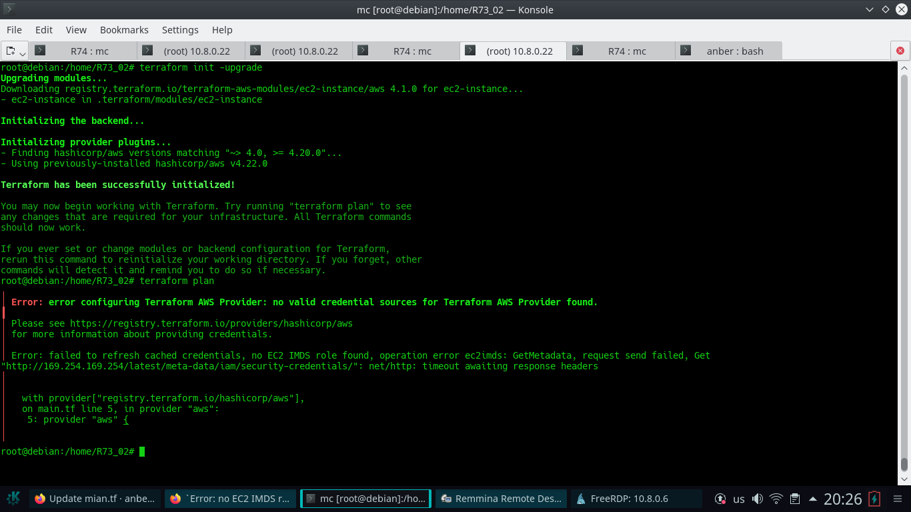

# Домашнее задание к занятию "7.4. Средства командной работы над инфраструктурой."

## Задача 2. Написать серверный конфиг для атлантиса.

.

> Смысл задания – познакомиться с документацией
> о [серверной](https://www.runatlantis.io/docs/server-side-repo-config.html) конфигурации и конфигурации уровня
> [репозитория](https://www.runatlantis.io/docs/repo-level-atlantis-yaml.html).
>
> Создай `server.yaml` который скажет атлантису:
> 1. Укажите, что атлантис должен работать только для репозиториев в вашем github (или любом другом) аккаунте.
> 1. На стороне клиентского конфига разрешите изменять `workflow`, то есть для каждого репозитория можно
> будет указать свои дополнительные команды.
> 1. В `workflow` используемом по-умолчанию сделайте так, что бы во время планирования не происходил `lock` состояния.
>
> Создай `atlantis.yaml` который, если поместить в корень terraform проекта, скажет атлантису:
> 1. Надо запускать планирование и аплай для двух воркспейсов `stage` и `prod`.
> 1. Необходимо включить автопланирование при изменении любых файлов `*.tf`.
>
> В качестве результата приложите ссылку на файлы `server.yaml` и `atlantis.yaml`.

## Ответ:

[server.yaml](./R74/server.yaml)

[atlantis.yaml](./R74/atlantis.yaml)

## Задача 3. Знакомство с каталогом модулей. 

.

> 1. В [каталоге модулей](https://registry.terraform.io/browse/modules) найдите официальный модуль от aws для создания `ec2` инстансов.
> 2. Изучите как устроен модуль. Задумайтесь, будете ли в своем проекте использовать этот модуль или непосредственно
> ресурс `aws_instance` без помощи модуля?
> 3. В рамках предпоследнего задания был создан ec2 при помощи ресурса `aws_instance`.
> Создайте аналогичный инстанс при помощи найденного модуля.
> 
> В качестве результата задания приложите ссылку на созданный блок конфигураций.

## Ответ:

### 1. ec2

### 2. В cвоем проекте модуль использовать не буду. Могут возникнуть проблемы в случае необходимости повторного получения модуля (обновления) с официального сайта.

### 3. Инстанс с помощью ec2

[main.tf](./R74/main.tf)

