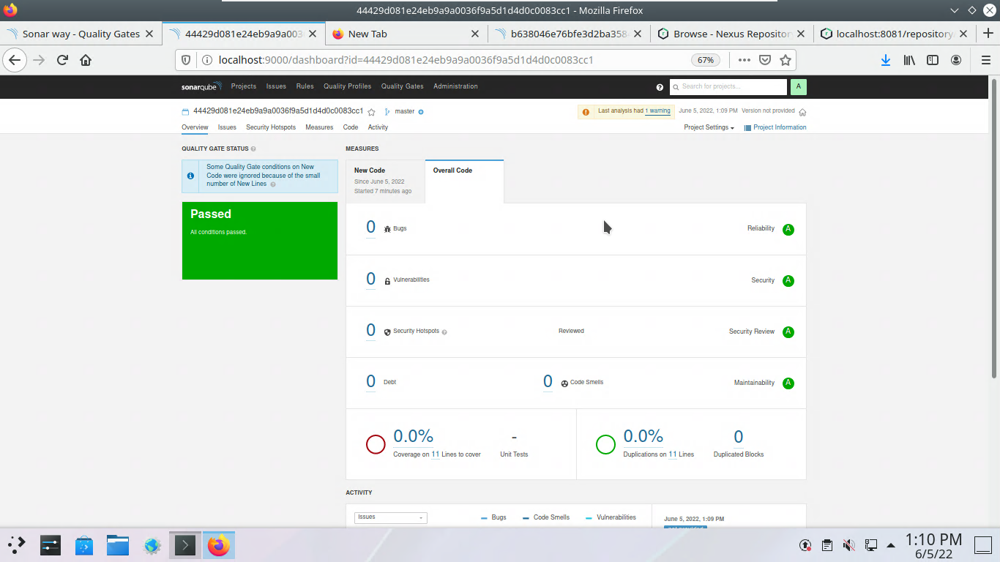
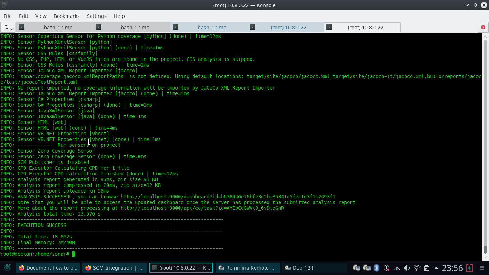

# Домашнее задание к занятию "09.02 CI\CD"

## Знакомоство с SonarQube

### Ответ







## Знакомство с Nexus

### Ответ

```xml
<?xml version="1.0" encoding="UTF-8"?>
<metadata modelVersion="1.1.0">
  <groupId>netology</groupId>
  <artifactId>java</artifactId>
  <versioning>
    <latest>8_282</latest>
    <release>8_282</release>
    <versions>
      <version>8_102</version>
      <version>8_282</version>
    </versions>
    <lastUpdated>20220602143734</lastUpdated>
  </versioning>
</metadata>
```

## Знакомство с Maven

### Ответ

```xml
<project xmlns="http://maven.apache.org/POM/4.0.0" xmlns:xsi="http://www.w3.org/2001/XMLSchema-instance"
  xsi:schemaLocation="http://maven.apache.org/POM/4.0.0 http://maven.apache.org/xsd/maven-4.0.0.xsd">
  <modelVersion>4.0.0</modelVersion>

  <groupId>com.netology.app</groupId>
  <artifactId>simple-app</artifactId>
  <version>1.0-SNAPSHOT</version>
   <repositories>
    <repository>
      <id>my-repo</id>
      <name>maven-public</name>
      <url>http://localhost:8081/repository/maven-public/</url>
    </repository>
  </repositories>
  <dependencies>
<!--     <dependency>
      <groupId>netology</groupId>
      <artifactId>java</artifactId>
      <version>8_282</version>
      <classifier>distrib</classifier>
      <type>tar.gz</type>
    </dependency> -->
  </dependencies>
</project>
```


### Дополнительно к **Знакомоство с SonarQube**

sonar-scaner выполнял через docker:

```bash
docker run --rm --network=host -e SONAR_HOST_URL=http://localhost:9000  -e SONAR_LOGIN="b638046e76bfe3d2ba35841c5fec1d3f1a2493f1" -v /home/sonar:/usr/src sonarsource/sonar-scanner-cli -Dsonar.projectKey="b638046e76bfe3d2ba35841c5fec1d3f1a2493f1"
```

Каталог `/home/sonar` содержал поправленный файл fail.py. Исправил строку `index += 1`

### Дополнительно к **Знакомство с `Maven`**

root@debian:/home/dw/apache-maven-3.8.5# mvn --version
Apache Maven 3.8.5 (3599d3414f046de2324203b78ddcf9b5e4388aa0)
Maven home: /home/dw/apache-maven-3.8.5
Java version: 17.0.3, vendor: Debian, runtime: /usr/lib/jvm/java-17-openjdk-amd64
Default locale: en_US, platform encoding: UTF-8
OS name: "linux", version: "5.10.0-9-amd64", arch: "amd64", family: "unix"
