# Домашнее задание к занятию "09.03 Jenkins"

## Решение

## Подготовка к выполнению

### 1 - 4 

Для доступа по сети из контейнера с `Jenkins` к `Docker` меняю в файле `/lib/systemd/system/docker.service` параметр `ExecStart`

```
#ExecStart=/usr/bin/dockerd -H fd:// --containerd=/run/containerd/containerd.sock
ExecStart=/usr/bin/dockerd -H tcp://0.0.0.0:4243 -H unix:///var/run/docker.sock
```

Перезапускаю сервис `docker` и проверяю доступность `api docker`:

```bash
curl http://localhost:4243/version
```

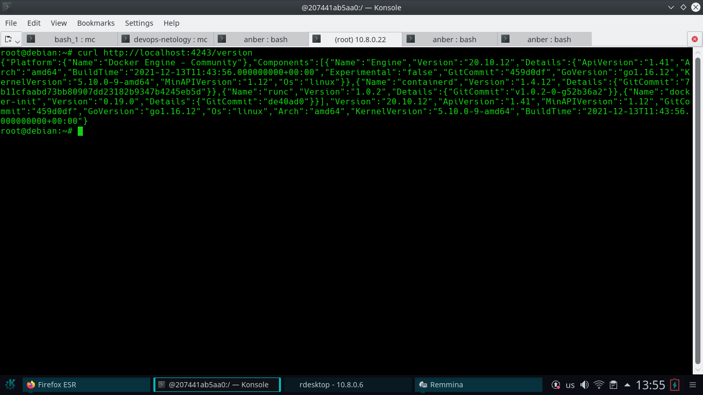

Запускаю из официального образа docker контейнер `jenkins`

```bash
docker run -d -v jenkins_home:/var/jenkins_home -p 8080:8080 -p 50000:50000 --restart=on-failure jenkins/jenkins:lts-jdk11
```

Скачиваю и запускаю для проверки `image` `aragast`.

```bash
docker run -d --name aragast aragast/agent:7
```

### 5 - 7

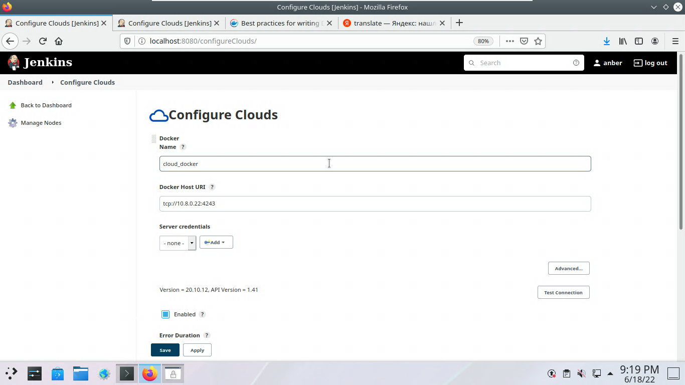

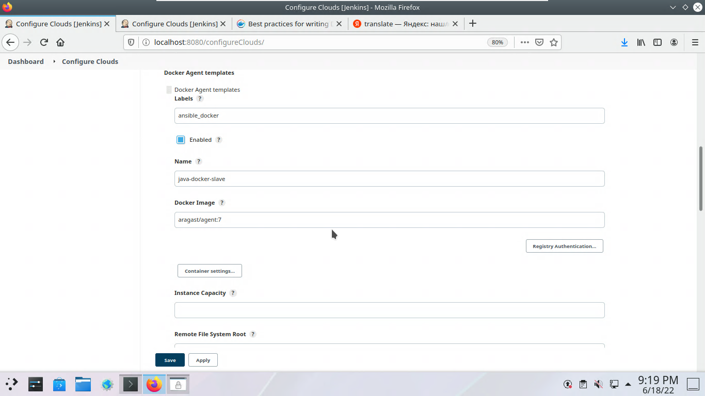

### 8 

[fork playbook](https://github.com/anber137/example-playbook.git)

## Основная часть

### 1. Сделать Freestyle Job, который будет запускать ansible-playbook из форка репозитория

```
ansible-vault decrypt secret --vault-password-file vault_pass
ansible-galaxy role install -r requirements.yml
ansible-playbook site.yml -i inventory/prod.yml
```

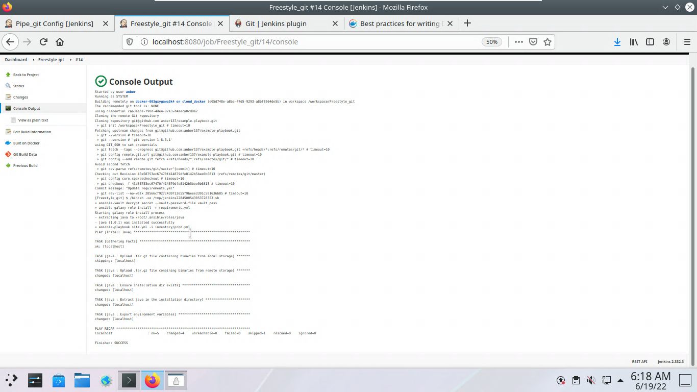

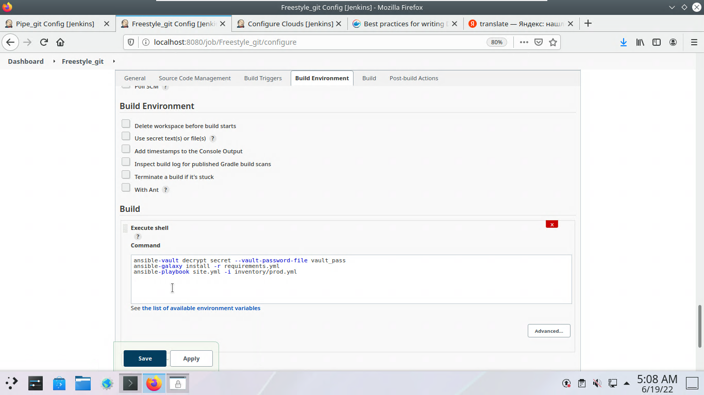

### 2. Сделать Declarative Pipeline, который будет выкачивать репозиторий с плейбукой и запускать её

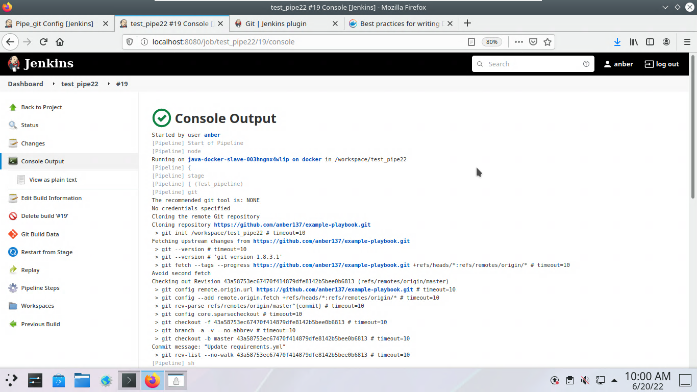
 
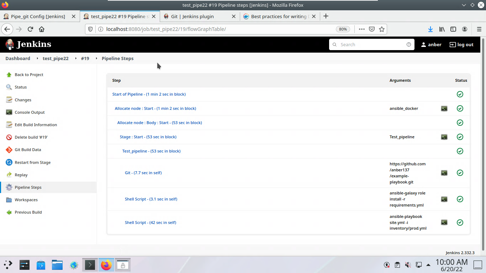

### 3. Перенести Declarative Pipeline в репозиторий в файл `Jenkinsfile`

```
pipeline {
    agent {
        label "ansible_docker"
    }

    stages {
        stage('prepare_node') {
            steps {
                git 'https://github.com/anber137/example-playbook.git'
                sh 'ansible-galaxy role install -r requirements.yml'
                sh 'ansible-playbook site.yml -i inventory/prod.yml'
            }
        }
    }
}
```

### 4. Перенастроить Job на использование `Jenkinsfile` из репозитория

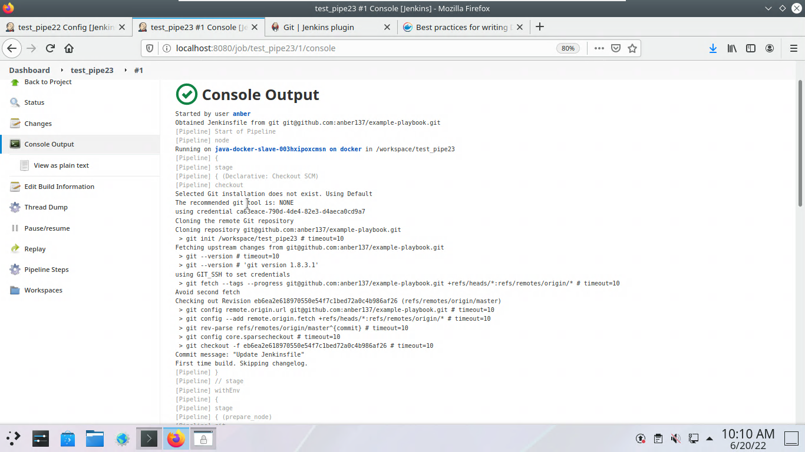
 
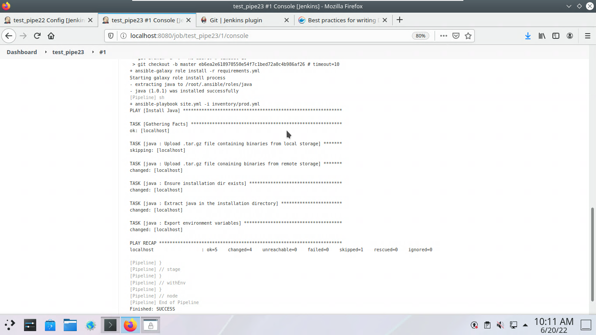


### 5. Создать Scripted Pipeline, наполнить его скриптом из 'pipeline'

### 6. Заменить credentialsId на свой собственный

```
node("ansible_docker"){
    stage("Git checkout"){
        git credentialsId: 'ca63eace-790d-4de4-82e3-d4aeca0cd9a7', url: 'git@github.com:anber137/example-playbook.git'
    }
    stage("Check ssh key"){
        secret_check=true
    }
    stage("Run playbook"){
        if (secret_check){
            sh 'ansible-vault decrypt secret --vault-password-file vault_pass'
            sh 'ansible-galaxy role install -r requirements.yml'
            sh 'ansible-playbook site.yml -i inventory/prod.yml'
        }
        else{
            echo 'no more keys'
        }

    }
}
```

### 7. Проверить работоспособность, исправить ошибки, исправленный Pipeline вложить в репозитрий в файл `ScriptedJenkinsfile`

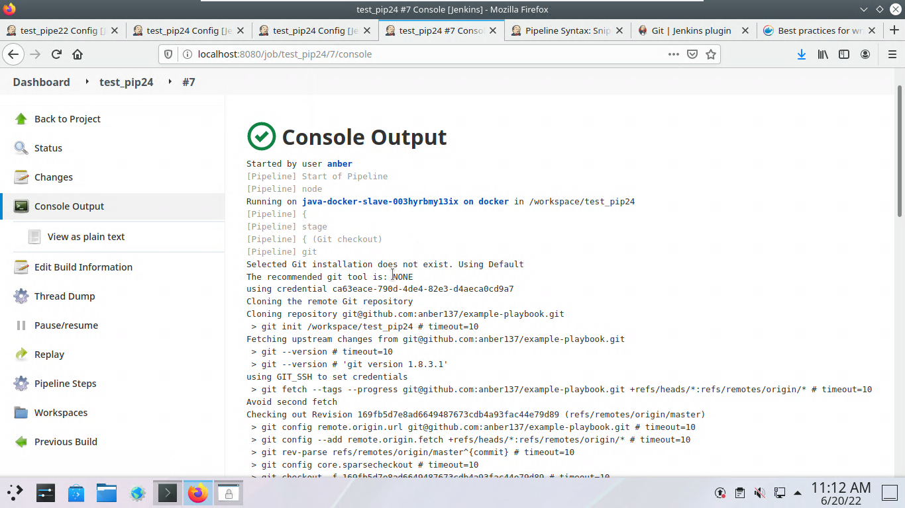

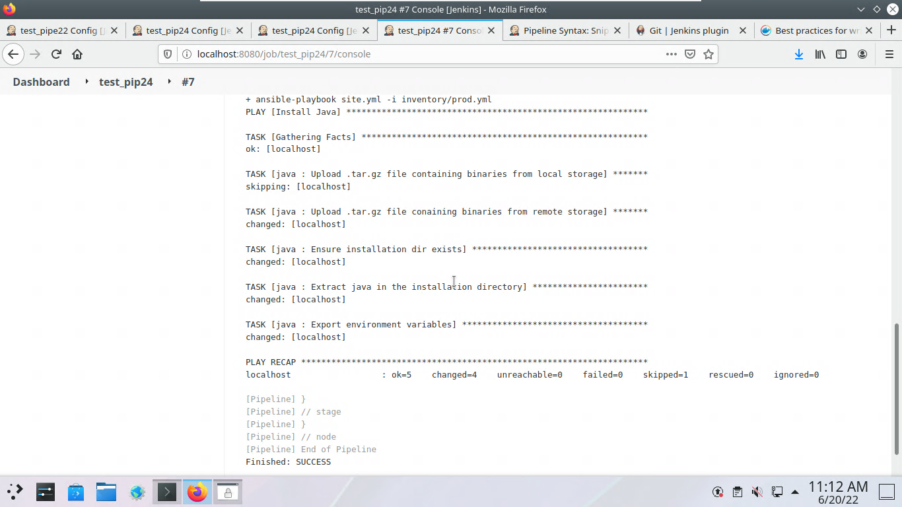

8. Отправить [ссылку](https://github.com/anber137/example-playbook.git) на репозиторий в ответ

