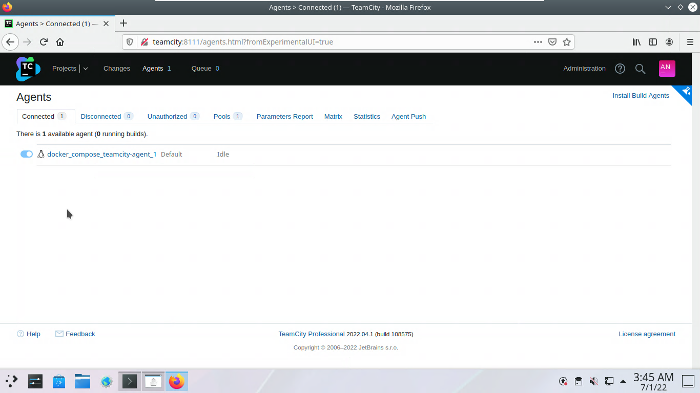
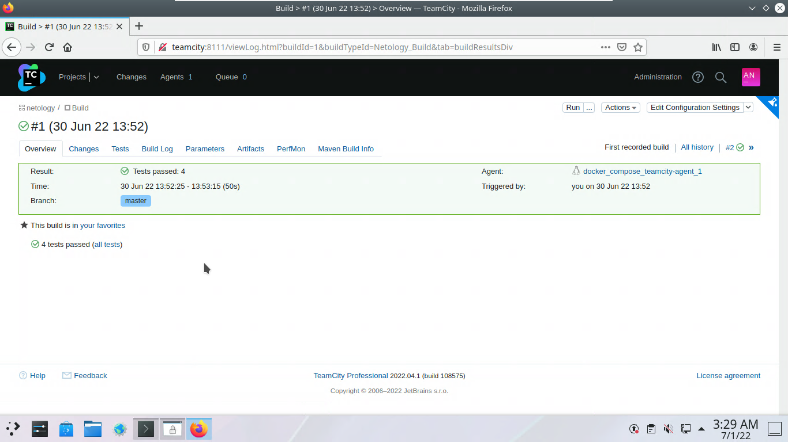
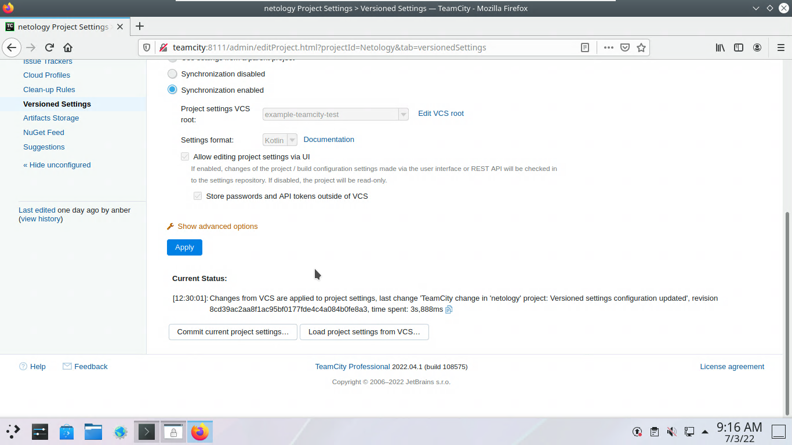
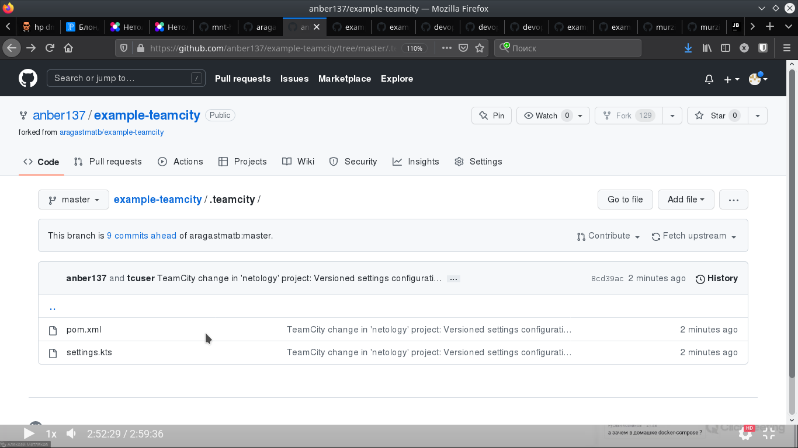
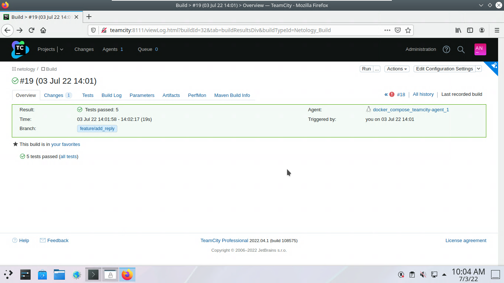
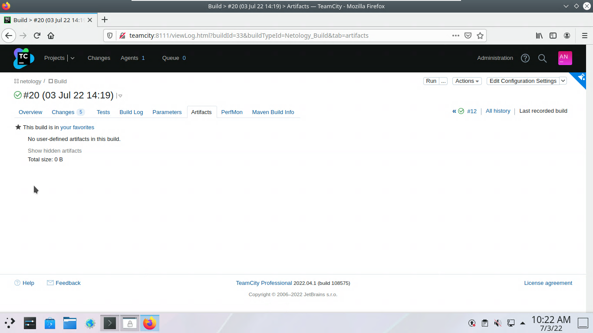
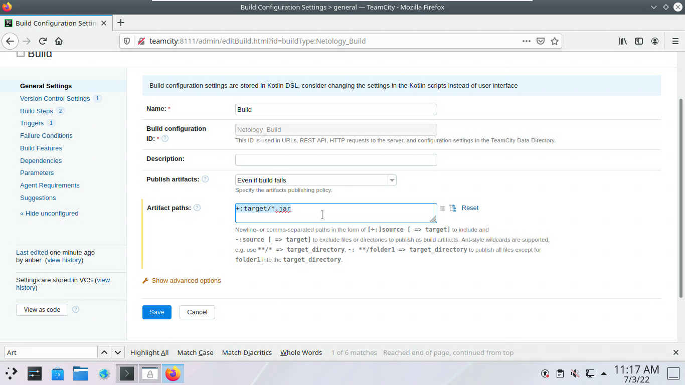
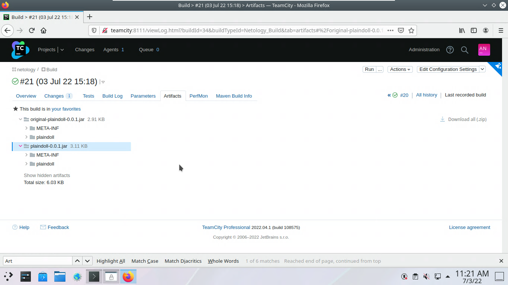

# Домашнее задание к занятию "09.04 `Teamcity`"

## Подготовка к выполнению 1-5

### 1 Поднимите инфраструктуру `teamcity`

Поправил [yaml](./R94/docker-compose.yml)  файл и для обращения по имени добавил в `/etc/hosts`

```
127.0.0.1 teamcity
```
### 4 Авторизуйте агент

Агента авторизовал:



### 5 Сделайте `fork` репозитория

[Форк](https://github.com/anber137/example-teamcity.git) выполнил

[Для себя на будущее](https://github.com/JetBrains/teamcity-docker-samples/blob/master/compose-ubuntu/docker-compose.yml)

## Основная часть

### 1. Создайте новый проект в `teamcity` на основе `fork`

### 2. Сделайте `autodetect` конфигурации

### 3. Сохраните необходимые шаги, запустите первую сборку `master'a`

Результат:



### 4 Поменяйте условия сборки: если сборка по ветке `master`, то должен происходит `mvn clean package`, иначе `mvn clean test`

Создал ветку `test_step4` и выполнил `push`:

``` bash
git checkout -b "test_step4"
git push --set-upstream origin test_step4
```

Создал два `Build Steps` c `Parameter-based execution conditions: teamcity.build.branch` со значением `value` master.

Запустил сборки на `master` и на `test_step4`, убедился, что условие работает:

### 5 Мигрируйте build configuration в репозиторий

Внес изменение в раздел: `Versioned Settings`



Убедился, что конфигурация мигрирована в репозиторий:



### 6 Создайте отдельную ветку feature/add_reply в репозитории

``` bash
git branch feature/add_reply
git checkout feature/add_reply
git push --set-upstream origin feature/add_reply

```

### 7 Напишите новый метод для класса Welcomer: метод должен возвращать произвольную реплику, содержащую слово hunter

Добавил новый метод `sayPhraseContainingHunter()`.

``` java
        public String sayPhraseContainingHunter() {
                return "The bad hunter is a vegetarian";
        }
```

### 8 Дополните тест для нового метода на поиск слова hunter в новой реплике

Добавил тест:

``` java
        @Test
        public void welcomerSaysPhraseContainingHunter(){
                assertThat(welcomer.sayPhraseContainingHunter(), containsString("hunter"));
        }
```

### 9 Сделайте push всех изменений в новую ветку в репозиторий

```bash
git add .
git commit -m 'change test'
git push
```

### 10 Убедитесь что сборка самостоятельно запустилась, тесты прошли успешно

Выполнил сборку, убедился, что все 5 тестов прошли успешно.



### 11 Внесите изменения из произвольной ветки `feature/add_reply` в `master` через `Merge`

Выполнил:

```bash
git checkout master
git pull origin master
git merge feature/add_reply
git push origin master
```
### 12 Убедитесь, что нет собранного артефакта в сборке по ветке `master`



### 13 Настройте конфигурацию так, чтобы она собирала `.jar` в артефакты сборки



### 14 Проведите повторную сборку мастера, убедитесь, что сбора прошла успешно и артефакты собраны



### 15 Проверьте, что конфигурация в репозитории содержит все настройки конфигурации из teamcity

Последние изменения в ветке `master` из п. 13 есть на [github.com](https://github.com/anber137/example-teamcity.git)

### 16 В ответ предоставьте ссылку на репозиторий

[link](https://github.com/anber137/example-teamcity.git)


