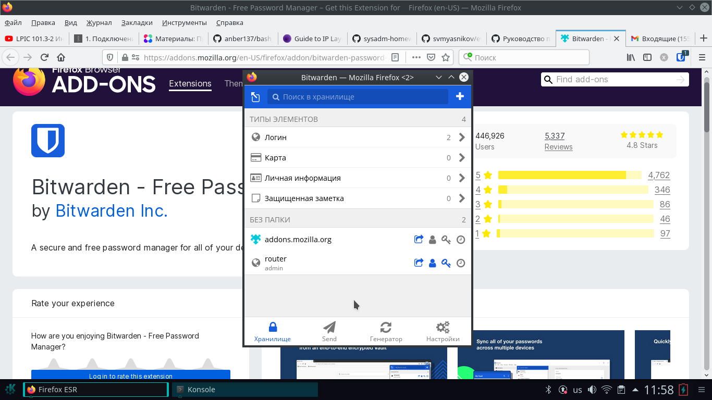
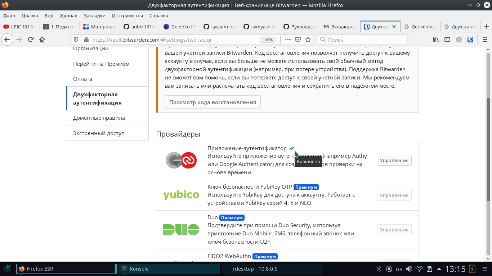
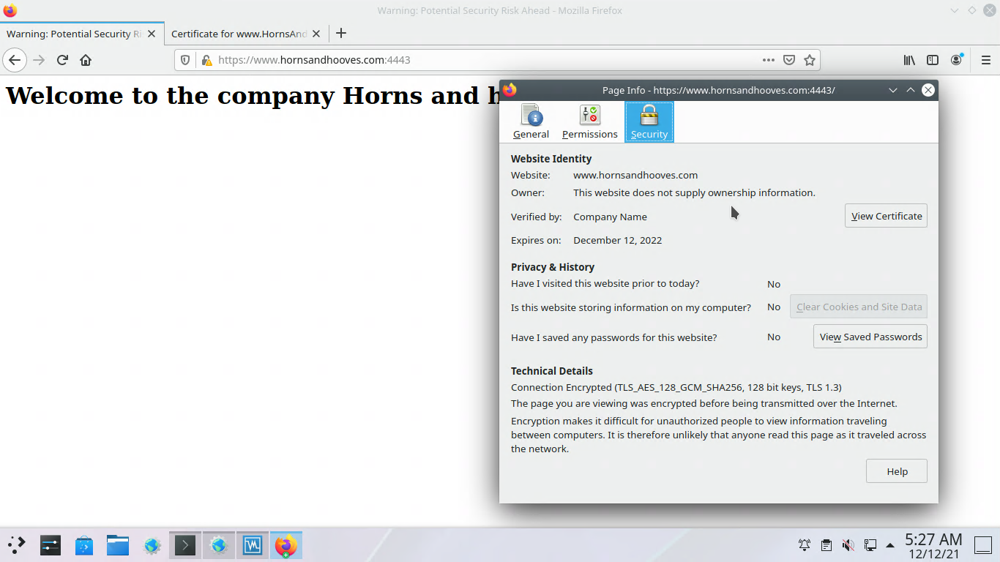
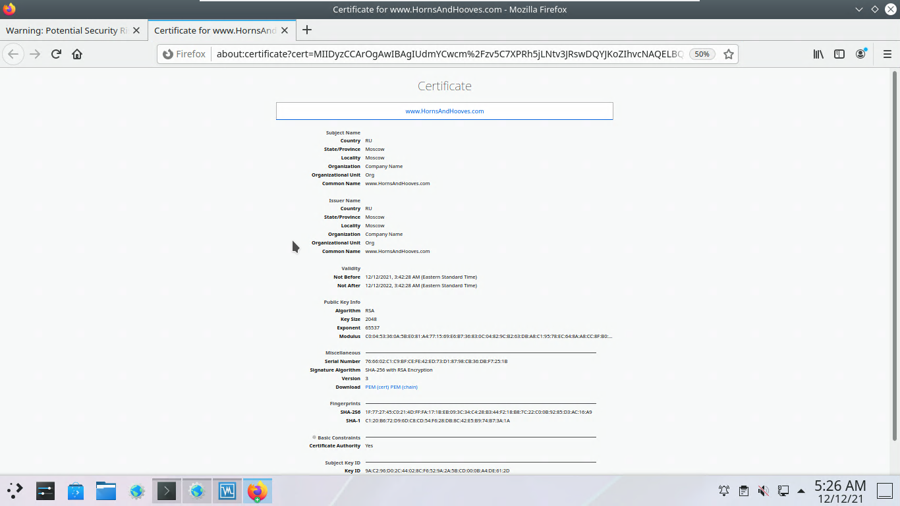
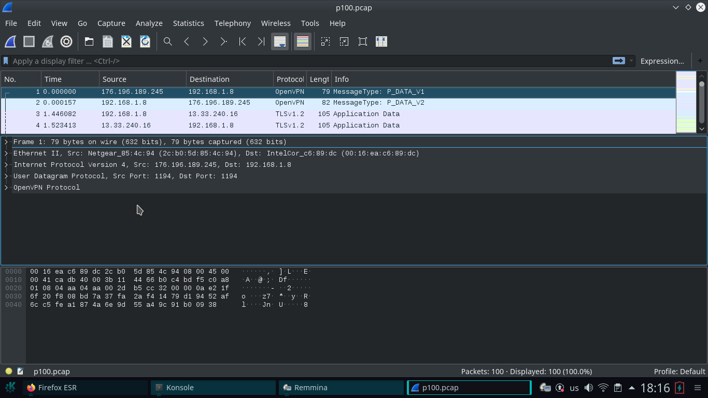

# Домашнее задание к занятию "3.9. Элементы безопасности информационных систем"

## 1. Установите Bitwarden плагин для браузера. Зарегестрируйтесь и сохраните несколько паролей.

### Решение:

## 2. Установите Google authenticator на мобильный телефон. Настройте вход в Bitwarden акаунт через Google authenticator OTP.

### Решение:

На телефон приложение установил, проверил, код из Google authenticator подходит

## 3. Установите apache2, сгенерируйте самоподписанный сертификат, настройте тестовый сайт для работы по HTTPS.

### Решение:

Выпонил в соответствии с презентацией:

	sudo apt-get install apache2 -y

	a2enmod ssl

	systemctl restart apache2

Генерация сертификата:

	openssl req -x509 -nodes -days 365 -newkey rsa:2048 \-keyout /etc/ssl/private/apache-selfsigned.key \-out /etc/ssl/certs/apache-selfsigned.crt \-subj "/C=RU/ST=Moscow/L=Moscow/O=Company Name/OU=Org/CN=www.HornsAndHooves.com"

Файл кнфигураци apache для сайта:

	vim /etc/apache2/sites-available/HornsAndHooves.com.conf
	<VirtualHost *:443> 
        	ServerName www.HornsAndHooves.com
       		DocumentRoot /var/www/HornsAndHooves.com
        	SSLEngine on
        	SSLCertificateFile /etc/ssl/certs/apache-selfsigned.crt
        	SSLCertificateKeyFile /etc/ssl/private/apache-selfsigned.key
	</VirtualHost>

Каталог с сайтом:

	sudo mkdir /var/www/HornsAndHooves.com

Файл с сайтом:

	vim /var/www/HornsAndHooves.com/index.html
	<h1>Welcome to the company Horns and hooves</h1>

Включение сайта (создание ссылки на файл конфигурации в sites-enabled):

	sudo a2ensite HornsAndHooves.com

Проверка:

## 4. Проверьте на TLS уязвимости произвольный сайт в интернете (кроме сайтов МВД, ФСБ, МинОбр, НацБанк, РосКосмос, РосАтом, РосНАНО и любых госкомпаний, объектов КИИ, ВПК ... и тому подобное).

### Решение:

Проверка на TLS уязвимости интернет магазина:

	root@zh:/home/devops/tls_test/testssl.sh# ./testssl.sh -U --sneaky https://www.uniqlo.com
	./testssl.sh: line 239: warning: setlocale: LC_COLLATE: cannot change locale (en_US.UTF-8): No such file or directory
	
	###########################################################
    	testssl.sh       3.1dev from https://testssl.sh/dev/
    	(6da72bc 2021-12-10 20:16:28 -- )
	
      	This program is free software. Distribution and
             	modification under GPLv2 permitted.
      	USAGE w/o ANY WARRANTY. USE IT AT YOUR OWN RISK!
	
       	Please file bugs @ https://testssl.sh/bugs/
	
	###########################################################
	
 	Using "OpenSSL 1.0.2-chacha (1.0.2k-dev)" [~183 ciphers]
 	on zh:./bin/openssl.Linux.x86_64
 	(built: "Jan 18 17:12:17 2019", platform: "linux-x86_64")
	
	
 	Start 2021-12-12 17:40:44        -->> 96.17.4.11:443 (www.uniqlo.com) <<--
	
 	rDNS (96.17.4.11):      a96-17-4-11.deploy.static.akamaitechnologies.com.
 	Service detected:       HTTP
	
	
 	Testing vulnerabilities 
	
 	Heartbleed (CVE-2014-0160)                not vulnerable (OK), no heartbeat extension
 	CCS (CVE-2014-0224)                       not vulnerable (OK)
 	Ticketbleed (CVE-2016-9244), experiment.  not vulnerable (OK)
 	ROBOT                                     not vulnerable (OK)
 	Secure Renegotiation (RFC 5746)           supported (OK)
 	Secure Client-Initiated Renegotiation     VULNERABLE (NOT ok), DoS threat (6 attempts)
 	CRIME, TLS (CVE-2012-4929)                not vulnerable (OK)
 	BREACH (CVE-2013-3587)                    no gzip/deflate/compress/br HTTP compression (OK)  - only supplied "/" tested
 	POODLE, SSL (CVE-2014-3566)               not vulnerable (OK)
 	TLS_FALLBACK_SCSV (RFC 7507)              Downgrade attack prevention supported (OK)
 	SWEET32 (CVE-2016-2183, CVE-2016-6329)    VULNERABLE, uses 64 bit block ciphers
 	FREAK (CVE-2015-0204)                     not vulnerable (OK)
 	DROWN (CVE-2016-0800, CVE-2016-0703)      not vulnerable on this host and port (OK)
                                           	make sure you don't use this certificate elsewhere with SSLv2 enabled services
                                           	https://censys.io/ipv4?q=82B87D0F89FC65EAA895F6B4E64E0FC8DC7D9998422378801F18A4088570ABC8 could help you to find out
 	LOGJAM (CVE-2015-4000), experimental      not vulnerable (OK): no DH EXPORT ciphers, no DH key detected with <= TLS 1.2
 	BEAST (CVE-2011-3389)                     TLS1: ECDHE-RSA-AES256-SHA ECDHE-RSA-AES128-SHA AES256-SHA AES128-SHA DES-CBC3-SHA 
                                           	VULNERABLE -- but also supports higher protocols  TLSv1.1 TLSv1.2 (likely mitigated)
 	LUCKY13 (CVE-2013-0169), experimental     potentially VULNERABLE, uses cipher block chaining (CBC) ciphers with TLS. Check patches
 	Winshock (CVE-2014-6321), experimental    not vulnerable (OK) - ARIA, CHACHA or CCM ciphers found
 	RC4 (CVE-2013-2566, CVE-2015-2808)        no RC4 ciphers detected (OK)
	
	
	 Done 2021-12-12 17:41:48 [  71s] -->> 96.17.4.11:443 (www.uniqlo.com) <<--

## 5. Установите на Ubuntu ssh сервер, сгенерируйте новый приватный ключ. Скопируйте свой публичный ключ на другой сервер. Подключитесь к серверу по SSH-ключу.

### Решение:

В соответствии с презентацией:

установка и запуск службы:

	apt-get install openssh-server
	systemctl start sshd.service
	systemctl enable sshd.service

Генерация ключа 
	ssh-keygen

Копирование на удаленный хост:

	anber@zh:~/.ssh$ ssh-copy-id anber@10.8.0.26
	/usr/bin/ssh-copy-id: INFO: Source of key(s) to be installed: "/home/anber/.ssh/id_rsa.pub"
	/usr/bin/ssh-copy-id: INFO: attempting to log in with the new key(s), to filter out any that are already installed
	/usr/bin/ssh-copy-id: INFO: 1 key(s) remain to be installed -- if you are prompted now it is to install the new keys
	anber@10.8.0.26's password: 
	
	Number of key(s) added: 1
	
	Now try logging into the machine, with:   "ssh 'anber@10.8.0.26'"
	and check to make sure that only the key(s) you wanted were added.

Проверка:	

	anber@zh:~/.ssh$ ssh anber@10.8.0.26
	Linux debian 5.10.0-9-amd64 #1 SMP Debian 5.10.70-1 (2021-09-30) x86_64
	
	The programs included with the Debian GNU/Linux system are free software;
	the exact distribution terms for each program are described in the
	individual files in /usr/share/doc/*/copyright.
	
	Debian GNU/Linux comes with ABSOLUTELY NO WARRANTY, to the extent
	permitted by applicable law.
	You have new mail.
	Last login: Sun Dec 12 04:23:08 2021 from 10.8.0.10
	anber@debian:~$ 
	
## 6. Переименуйте файлы ключей из задания 5. Настройте файл конфигурации SSH клиента, так чтобы вход на удаленный сервер осуществлялся по имени сервера.

### Решение:	

Переименовал id_rsa:

	mv ~/.ssh/id_rsa ~/.ssh/deb26.sec

Создал файл кнфигураци ~/.ssh/config

	anber@zh:~/.ssh$ cat config 
	Host deb26
	 HostName 10.8.0.26
	 IdentityFile ~/.ssh/deb26.sec

Проверл подключение по имени:

	anber@zh:~/.ssh$ ssh deb26
	Linux debian 5.10.0-9-amd64 #1 SMP Debian 5.10.70-1 (2021-09-30) x86_64
	
	The programs included with the Debian GNU/Linux system are free software;
	the exact distribution terms for each program are described in the
	individual files in /usr/share/doc/*/copyright.
	
	Debian GNU/Linux comes with ABSOLUTELY NO WARRANTY, to the extent
	permitted by applicable law.
	You have new mail.
	Last login: Sun Dec 12 05:58:32 2021 from 10.8.0.10
	anber@debian:~$ 
	
## 7. Соберите дамп трафика утилитой tcpdump в формате pcap, 100 пакетов. Откройте файл pcap в Wireshark.

### Решение:

Собираю дамп из 100 пакетов в файл: 	

	root@zh:/home/devops# tcpdump -c 100 -w /home/devops/p100.pcap -i wlan0
	

Устанавливаю Wireshark:

	apt-get install wireshark -y

После успешной установки открываю файл p100.pcap

