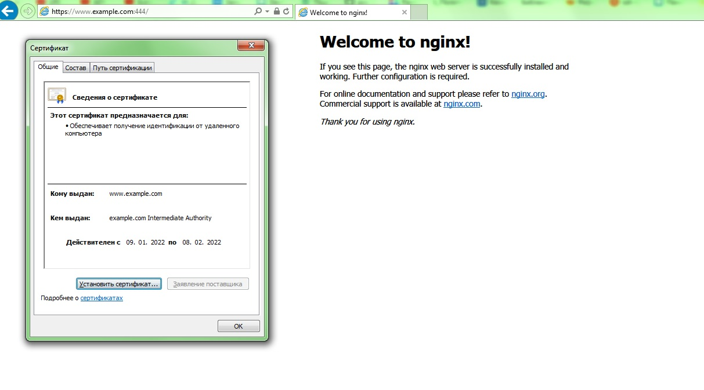
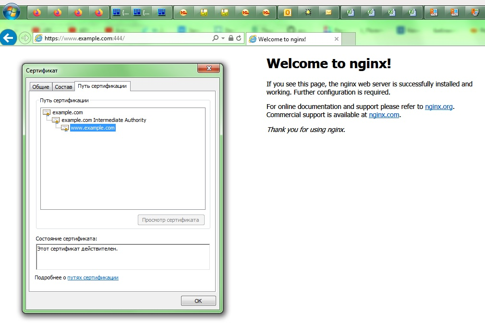

# Курсовая работа по итогам модуля "DevOps и системное администрирование"

## 2. Установите ufw и разрешите к этой машине сессии на порты 22 и 443, при этом трафик на интерфейсе localhost (lo) должен ходить свободно на все порты.

### Решение:

Установка ufw не потребовалась, так как данный пакет уже был в:

	root@vagrant:/opt/ssl# cat /etc/issue
	Ubuntu 20.04.2 LTS \n \l


Выполнил следующие команды:

```bash
ufw enable
ufw default deny incoming
ufw default allow outgoing
ufw allow 22/tcp
ufw allow 443/tcp
ufw status
```

Проверил правила:

	Status: active
	
	To                         Action      From
	--                         ------      ----
	22/tcp                     ALLOW       Anywhere                  
	443/tcp                    ALLOW       Anywhere                  
	22/tcp (v6)                ALLOW       Anywhere (v6)             
	443/tcp (v6)               ALLOW       Anywhere (v6) 

## 3. Установите hashicorp vault (инструкция по ссылке).

### Решение:

Выполнил в соответствии с инструкцией:

```bash
curl -fsSL https://apt.releases.hashicorp.com/gpg | sudo apt-key add -
apt-add-repository "deb [arch=amd64] https://apt.releases.hashicorp.com $(lsb_release -cs) main"
apt-get update && sudo apt-get install vault
```

Проверил:
	
	root@vagrant:/home/vagrant# vault -v
	Vault v1.9.2

## 4. Cоздайте центр сертификации по инструкции (ссылка) и выпустите сертификат для использования его в настройке веб-сервера nginx (срок жизни сертификата - месяц).

### Решение:

Выполнил все команды по инструкции. Заменять Example.com на другое доменное имя не стал, так как нет необходимости.
При генерации самого ключа заменил домен третьего уровня test.example.com на www.example.com.

```bash
vault write -format=json pki_int/issue/example-dot-com common_name="www.example.com" ttl="720h" > www.example.com.crt
```

Также так как в дальнейшем испольуется, установил JSON processor:

```bash
apt-get install jq 
```

## 5. Установите корневой сертификат созданного центра сертификации в доверенные в хостовой системе.

### Решение:

В случае хостовой системы Linux помещаем сертификат в:

	/usr/local/share/ca-certificates

И выполняем команду:

```bash
update-ca-certificates
```

В windows просто помещаем сертификат в доверенный центр сертификации:





Порт используется 444, так как выполнен проброс через SSH, a 443 был занят.

## 6. Установите nginx.

### Решение:

Выполнил:

```bash
apt-get install nginx -y
```

Проверил:

```bash
vagrant@vagrant:/opt/ssl$ nginx -v
nginx version: nginx/1.18.0 (Ubuntu)
```

## 7. По инструкции (ссылка) настройте nginx на https, используя ранее подготовленный сертификат:

### Решение:

Использовал стандартную стартовую страницу nginx.

Изменил файл: /etc/nginx/sites-available/default

	server {
	
        	listen 443 ssl;
        	ssl_certificate /etc/nginx/ssl/www.example.com.crt.pem;
        	ssl_certificate_key /etc/nginx/ssl/www.example.com.crt.key;
        	ssl_protocols       TLSv1 TLSv1.1 TLSv1.2;
        	ssl_ciphers         HIGH:!aNULL:!MD5;
        	root /var/www/html;
        	index index.html index.htm index.nginx-debian.html;
        	location / {
                	try_files $uri $uri/ =404;
        	}
	}
	

Перезапуслил nginx:
```bash
	systemctl restart nginx
```

Посмотрел ошибки через journalctl -xe Устранил. Перезапустил.

	
## 8. Откройте в браузере на хосте https адрес страницы, которую обслуживает сервер nginx.
	
### Решение:
	


## 9. Создайте скрипт, который будет генерировать новый сертификат в vault:

### Решение:


	#!/bin/bash
	
	export VAULT_ADDR=http://127.0.0.1:8200
	export VAULT_TOKEN=root
	
	crt="/opt/ssl/www.example.com.crt"
	path="/etc/nginx/ssl/"
	
	/usr/bin/vault write -format=json pki_int/issue/example-dot-com common_name="www.example.com" ttl="720h" > $crt
	chown www-data:www-data $crt
	
	cat $crt | jq -r .data.certificate > $path"www.example.com.crt.pem"
	cat $crt | jq -r .data.issuing_ca >> $path"www.example.com.crt.pem"
	cat $crt | jq -r .data.private_key > $path"www.example.com.crt.key"
	
	systemctl restart nginx

	
## 10. Поместите скрипт в crontab, чтобы сертификат обновлялся какого-то числа каждого месяца в удобное для вас время.

### Решение:

С помощью crontab -e добавил задание, которое выполняется каждые 20 дней в 23 часа 59 минут.

	59 23 */20 * * /opt/ssl/create_cert.sh

Перезапустил cron:

```bash
systemctl restart cron.service
```

Для теста работы скрипта изменил время на каждые три минуты: 

	root@vagrant:/home/vagrant# crontab -l | grep -v "#"

	*/3 * * * * /opt/ssl/create_cert.sh

В срипт добавил:

	root@vagrant:/opt/ssl# systemctl stop cron

Данный Screenshot получин после того, как сертификат был перевыпушен через cron:


