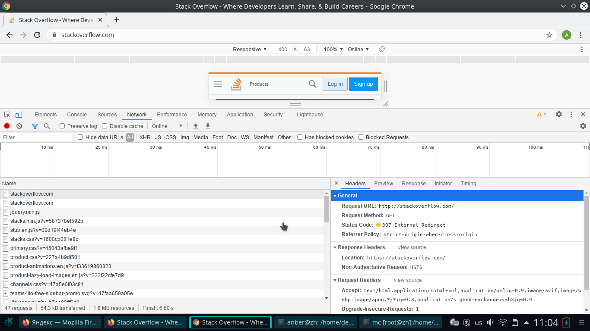
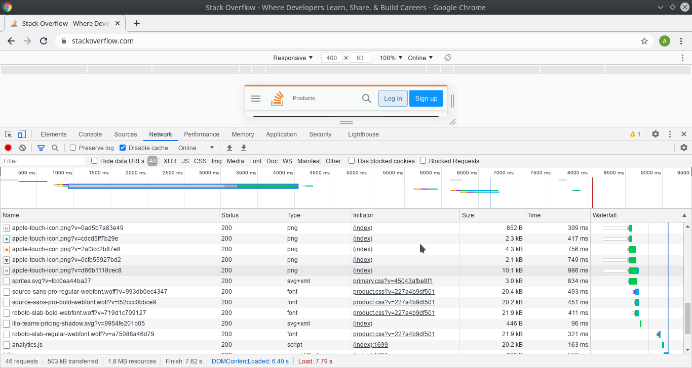
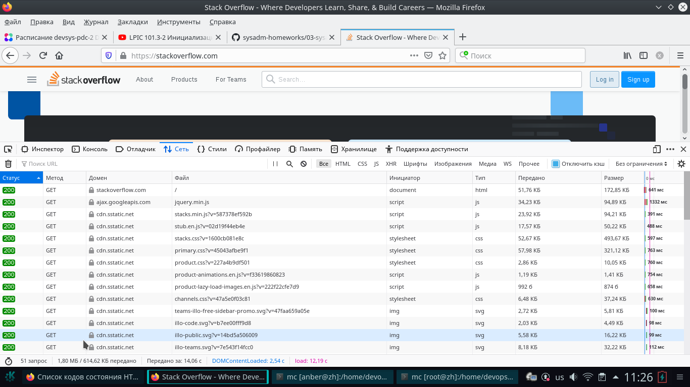
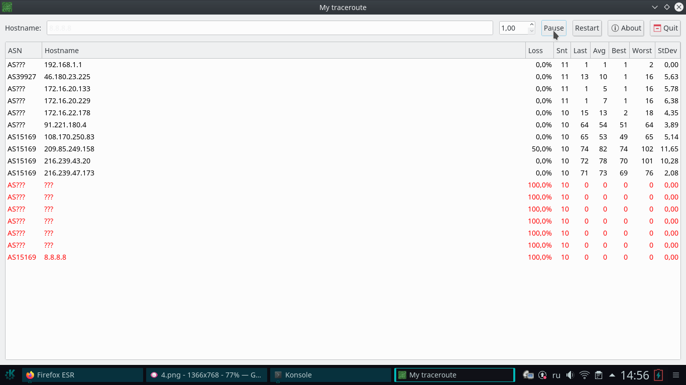

# Домашнее задание к занятию "3.6. Компьютерные сети, лекция 1"

## 1. Работа c HTTP через телнет.

### Решение

	root@debian:~# telnet stackoverflow.com 80
	Trying 151.101.129.69...
	Connected to stackoverflow.com.
	Escape character is '^]'.
	GET /questions HTTP/1.0
	HOST: stackoverflow.com

	HTTP/1.1 301 Moved Permanently
	cache-control: no-cache, no-store, must-revalidate
	location: https://stackoverflow.com/questions
	x-request-guid: 167a072e-601a-421e-8f5a-0a6fb5935902
	feature-policy: microphone 'none'; speaker 'none'
	content-security-policy: upgrade-insecure-requests; frame-ancestors 'self' https://stackexchange.com
	Accept-Ranges: bytes
	Date: Mon, 06 Dec 2021 01:15:14 GMT
	Via: 1.1 varnish
	Connection: close
	X-Served-By: cache-hhn4050-HHN
	X-Cache: MISS
	X-Cache-Hits: 0
	X-Timer: S1638753315.538234,VS0,VE170
	Vary: Fastly-SSL
	X-DNS-Prefetch-Control: off
	Set-Cookie: prov=7c437fa7-13b1-4a79-73c8-dd15b8d5a125; domain=.stackoverflow.com; expires=Fri, 01-Jan-2055 00:00:00 GMT; path=/; HttpOnly

	Connection closed by foreign host.

HTTP код 301.

Описание из [https://ru.wikipedia.org/wiki/HTTP_301):
 
301 — Код состояния HTTP 301 или Moved Permanently (с англ. — «Перемещено навсегда») — стандартный код ответа HTTP, получаемый в ответ от сервера в ситуации, когда запрошенный ресурс был на постоянной основе перемещён в новое месторасположение, и указывающий на то, что текущие ссылки, использующие данный URL, должны быть обновлены. Адрес нового месторасположения ресурса указывается в поле Location получаемого в ответ заголовка пакета протокола HTTP.

## 2. Повторите задание 1 в браузере, используя консоль разработчика F12.

### Решение

Request URL: http://stackoverflow.com/
Request Method: GET
Status Code: 307 Internal Redirect
Referrer Policy: strict-origin-when-cross-origin

Описание из [wiki](https://ru.wikipedia.org/wiki/%D0%A1%D0%BF%D0%B8%D1%81%D0%BE%D0%BA_%D0%BA%D0%BE%D0%B4%D0%BE%D0%B2_%D1%81%D0%BE%D1%81%D1%82%D0%BE%D1%8F%D0%BD%D0%B8%D1%8F_HTTP):
307 Temporary Redirect («временное перенаправление»)
В данном случае возникает, так как сайт работает по протоколу HTTPS, а мы вводим HTTP. 
На такой случай на сайте предусмотрено перенаправление с HTTP 80 на HTTPS 443.

Дольше всего (986 ms)  обрабатывался запрос загруки картинки png.

В другом браузере и в другое время дольше всего (1332 ms) обрабатывался запрос библиотеки JavaScript с ajax.googleapis.com.

## 3. Какой IP адрес у вас в интернете?

### Решение

Мой IP адрес в сети Интернет: 46.180.51.30

## 4. Какому провайдеру принадлежит ваш IP адрес? Какой автономной системе AS? Воспользуйтесь утилитой whois

### Ответ:
	#whois 46.180.51.30

	netname:        GOODLINE-INFO
	descr:          E-Light-Telecom
	origin:         AS39927

т.е. провайдер GOODLINE-INFO, номар автономной системы 39927

## 5. Через какие сети проходит пакет, отправленный с вашего компьютера на адрес 8.8.8.8? Через какие AS? Воспользуйтесь утилитой traceroute

### Ответ

	root@zh:/home/devops/bash_01/bash_1# traceroute -An 8.8.8.8
	traceroute to 8.8.8.8 (8.8.8.8), 30 hops max, 60 byte packets
 	1  192.168.1.1 [*]  0.684 ms  0.821 ms  1.135 ms
 	2  46.180.23.225 [AS39927]  2.432 ms  2.460 ms  2.530 ms
 	3  172.16.20.133 [*]  2.585 ms  2.654 ms  3.374 ms
 	4  172.16.20.229 [*]  7.660 ms  8.096 ms  8.197 ms
 	5  172.16.22.178 [*]  7.359 ms  8.485 ms  8.650 ms
 	6  91.221.180.4 [AS13094]  55.605 ms  74.741 ms  85.793 ms
 	7  108.170.250.34 [AS15169]  48.277 ms 108.170.250.83 [AS15169]  50.303 ms 108.170.250.99 [AS15169]  55.155 ms
 	8  209.85.249.158 [AS15169]  70.917 ms 142.251.49.24 [AS15169]  65.889 ms 209.85.255.136 [AS15169]  70.412 ms
 	9  172.253.65.82 [AS15169]  64.514 ms 74.125.253.109 [AS15169]  68.735 ms 172.253.65.82 [AS15169]  67.338 ms
	10  216.239.62.9 [AS15169]  68.822 ms 209.85.251.63 [AS15169]  67.453 ms 74.125.253.147 [AS15169]  69.135 ms
	11  * * *
	12  * * *
	13  * * *
	14  * * *
	15  * * *
	16  * * *
	17  * * *
	18  * * *
	19  * * *
	20  8.8.8.8 [AS15169]  88.054 ms *  83.434 ms
	
Шлюзы:

* (1) Внутренняя сеть за роутером, 192.168.1.1 - адрес шлюза
* (2) Шлюз провайдера goodline обеспечивающего последную милю
* (3,4,5) 172.16.20.133, 172.16.20.229, 172.16.22.178 внутренняя сеть провайдера goodline из диапазона PRIVATE
* (6) оператор связи milecom.ru
* (7,8,9,10) шлюзы google

Автономные системы:

1. AS39927 провайдер goodline
2. AS13094 оператор связи milecom.ru
3. AS15169 Google

## 6. Повторите задание 5 в утилите mtr. На каком участке наибольшая задержка - delay?

### Ответ

При трасировки пакетов через утилиту mtr, маршрут внути сети Google отличается от ранее выполненной через traceroute
и наибольшая средняя задерка (delay) 82ms на шлюзе 209.85.249.158

## 7. Какие DNS сервера отвечают за доменное имя dns.google? Какие A записи? воспользуйтесь утилитой dig

### Ответ

За доменное имя dns.google отвечают четыре DNS сервера:

	anber@zh:/$ dig NS +short @8.8.8.8 dns.google
	ns4.zdns.google.
	ns3.zdns.google.
	ns2.zdns.google.
	ns1.zdns.google.

Имеются два A записи:

	anber@zh:/$ dig A +noshort @8.8.8.8 dns.google
	
	; <<>> DiG 9.10.3-P4-Debian <<>> A +noshort @8.8.8.8 dns.google
	; (1 server found)
	;; global options: +cmd
	;; Got answer:
	;; ->>HEADER<<- opcode: QUERY, status: NOERROR, id: 62093
	;; flags: qr rd ra ad; QUERY: 1, ANSWER: 2, AUTHORITY: 0, ADDITIONAL: 1
	
	;; OPT PSEUDOSECTION:
	; EDNS: version: 0, flags:; udp: 512
	;; QUESTION SECTION:
	;dns.google.                    IN      A
	
	;; ANSWER SECTION:
	dns.google.             63      IN      A       8.8.8.8
	dns.google.             63      IN      A       8.8.4.4
	
	;; Query time: 70 msec
	;; SERVER: 8.8.8.8#53(8.8.8.8)
	;; WHEN: Sun Dec 05 15:05:58 +07 2021
	;; MSG SIZE  rcvd: 71
	
## 8. Проверьте PTR записи для IP адресов из задания 7. Какое доменное имя привязано к IP? воспользуйтесь утилитой dig

## Ответ

PTR для IP адресов из А записей:

	anber@zh:/$ dig  @8.8.8.8 -x 8.8.4.4 | grep PTR | grep -v ';'
	4.4.8.8.in-addr.arpa.   19950   IN      PTR     dns.google.

	anber@zh:/$ dig  @8.8.8.8 -x 8.8.8.8 | grep PTR | grep -v ';'
	8.8.8.8.in-addr.arpa.   11631   IN      PTR     dns.google.

К IP адресам 8.8.4.4 и 8.8.8.8 привязано доменное имя dns.google.

